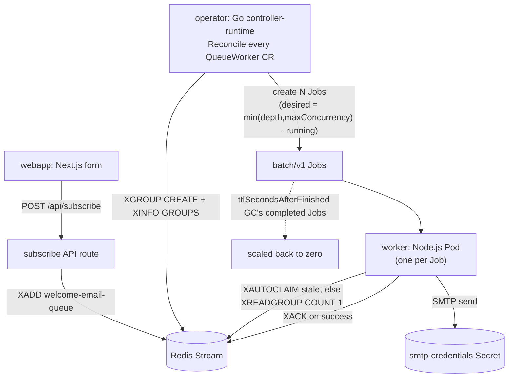

# Serverless Welcome-Email System on Kubernetes

A queue-driven, pod-per-message serverless pattern on Kubernetes: a web form
enqueues a request in Redis, a generic Kubernetes Operator watches the queue
and spins up a single-shot worker Job per pending item, and when the queue
is empty, nothing runs — true scale-to-zero.

This repo wires up exactly one queue (welcome emails), but the operator and
its CRD are generic: nothing in the operator's Go code mentions "email" —
it just points a Redis stream at a worker image. Any number of independent
queues can be declared side by side, each with its own worker image,
concurrency limit, and poll interval.

## Architecture



Key design principles preserved throughout the implementation:

- **The operator never touches individual messages.** It only decides *how
  many* workers to run per `QueueWorker` CR (via `XINFO GROUPS` — depth =
  the group's `lag` + `pending`, since `XACK` never removes entries from a
  stream — a `min(depth, maxConcurrency) - running` calculation, and
  `batch/v1` Job creates). Message-level delivery coordination — retries,
  at-least-once, acking, reclaiming messages from dead consumers via
  `XAUTOCLAIM` — is entirely the Redis consumer group's job, handled inside
  the worker container.
- **The CRD is generic.** `operator/api/v1alpha1/queueworker_types.go` and
  `operator/internal/controller/queueworker_controller.go` contain no
  email-specific logic. The welcome-email behavior lives entirely in
  `worker/`, which is just one possible `QueueWorker` payload.
- **Jobs, not bare Pods**, for worker execution — retry/backoff
  (`backoffLimit`) and completion tracking come for free.
- **Poll-based reconciliation** (`RequeueAfter`) because queue depth is
  external state; nothing triggers a Kubernetes watch event when a Redis
  stream grows.

## Repository layout

```
serverless-poc/
├── Makefile         # local dev driver — see "Local development & testing"
├── webapp/          # Next.js — form UI + /api/subscribe, one app
├── operator/        # Go — controller-runtime QueueWorker operator
├── worker/          # Node.js/TypeScript — welcome-email worker
└── deploy/
    ├── kind/        # 3-node local cluster config used by the Makefile
    └── helm/
        ├── webapp/      # Helm chart #1
        ├── operator/    # Helm chart #2 — dependency-chart-ready, bundles Redis
        └── monitoring/  # Helm chart #3 — Grafana + Prometheus + OTel collector
```

Each component has its own `README.md` with implementation-specific notes:
[`operator/README.md`](operator/README.md), [`deploy/helm/operator/README.md`](deploy/helm/operator/README.md), [`deploy/helm/webapp/README.md`](deploy/helm/webapp/README.md).

## Cross-chart coupling (read this before installing)

`webapp` and `operator` are two independently-installable Helm charts by
design — installing/upgrading/uninstalling one never affects the other.
The tradeoff: nothing automatically keeps their Redis stream name in sync.

- `deploy/helm/webapp/values.yaml` → `redis.stream`
- `deploy/helm/operator/values.yaml` → `queueWorkers[0].redis.stream`

Both default to `welcome-email-queue`. If you change one, change the other.
This is documented in both charts' `values.yaml` comments and their
`README.md` files — it is intentionally not unified into a single shared
values file, since that would defeat the point of having two independent
charts.

## Assumptions made explicit

The task spec left a few things ambiguous or already-changed-since-written;
reasonable choices were made rather than stopping to ask:

- **"Operator (as dependency chart)"** is interpreted as: (a) the operator
  Helm chart ([`deploy/helm/operator`](deploy/helm/operator)) is a clean,
  standalone, semantically-versioned chart with no hardcoded ties to the
  welcome-email use case, so it could later be declared as a
  `dependencies:` entry in another project's `Chart.yaml`; and (b) Redis is
  bundled as an actual Helm chart dependency inside the operator chart (the
  Bitnami `redis` chart), toggleable off via `redis.enabled: false` in
  `values.yaml` to point at an external/managed Redis instead.
- **Bitnami Redis chart distribution**: Bitnami charts are now distributed
  as OCI artifacts rather than a classic Helm repo index, so the dependency
  in [`deploy/helm/operator/Chart.yaml`](deploy/helm/operator/Chart.yaml)
  points at `oci://registry-1.docker.io/bitnamicharts` (version `23.x.x`)
  rather than `https://charts.bitnami.com/bitnami`.
- **Operator Go toolchain version**: the spec suggested `golang:1.22-alpine`
  for the operator's Dockerfile build stage. Current `k8s.io/client-go` and
  `sigs.k8s.io/controller-runtime` releases require a newer Go language
  version than 1.22. The build stage uses `golang:1.26-alpine` instead,
  matching what `go mod tidy` actually resolved — see
  [`operator/README.md`](operator/README.md) for detail.
- **Worker implementation language**: written in TypeScript (compiled to
  `dist/` at build time), not plain JavaScript, for type safety around the
  Redis/SMTP env var contract — otherwise follows the spec's pseudocode
  exactly.
- **Webapp UI stack**: Tailwind CSS, no component library, per the spec's
  "keep it simple" guidance.

## Local development & testing

### Prerequisites

`make`, `kind`, `kubectl`, `helm` (v3), `docker`, `go` (1.26+), `node` (20+).

Everything below is driven by the top-level [`Makefile`](Makefile), which
supports two platforms via the `PLATFORM` variable (every target honors it):

- **`PLATFORM=kind` (default)** — a 3-node kind cluster (1 control-plane +
  2 workers) named `serverless-poc`, defined in
  [`deploy/kind/kind-config.yaml`](deploy/kind/kind-config.yaml).
- **`PLATFORM=minikube`** — minikube with the three apps sandboxed under
  **gVisor** (`runtimeClassName: gvisor`, handler `runsc`). `make cluster
  PLATFORM=minikube` starts minikube with `--container-runtime=containerd`
  if it isn't running, and enables the `gvisor` addon if it isn't enabled
  (pinning `registry.k8s.io/minikube/gvisor:v0.0.4` — the addon's default
  image is missing from its registry). The gvisor RuntimeClass is applied
  to the webapp Deployment, the operator Deployment, and every worker Job
  (via the `runtimeClassName` values in both charts and the QueueWorker
  CRD's `spec.worker.runtimeClassName` field); the bundled Redis and the
  monitoring stack stay on the default runtime.

  One access difference: `kubectl port-forward` cannot reach gVisor pods
  (it dials the pod netns loopback, but a sandboxed pod's sockets live in
  runsc's userspace netstack — traffic to the pod IP works, loopback does
  not). On minikube the webapp Service is therefore a NodePort, and
  `make webapp` / `make port-forward` open it via `minikube service
  webapp --url`, which prints a dynamic `http://127.0.0.1:<port>` URL
  instead of the fixed :4000.

```bash
make up                    # kind
make up PLATFORM=minikube  # minikube + gVisor
```

All `kubectl`/`helm` invocations inside the Makefile are pinned to the
platform's context (`kind-serverless-poc` or `minikube`), so it never
touches whatever your current kubeconfig context happens to be.

### 1. Configure SMTP credentials

```bash
make smtp-secrets
```

This copies `deploy/helm/operator/values-secrets.yaml.example` to
`deploy/helm/operator/values-secrets.yaml` (gitignored — real credentials
never get committed). Edit it with your provider's SMTP host, port, user,
password, and from-address. For Gmail: `smtp.gmail.com:587`, your full
address as `user`, and an **App Password** (not your account password) as
`pass`.

Whenever this file exists, every `make up` / `make deploy` passes it to
helm automatically. Without it, the chart's defaults point at a `maildev`
test catcher that isn't deployed — worker Jobs would fail their SMTP
connection — so create it first.

### 2. Bring everything up

```bash
make up
```

This runs, in order: `cluster` (create the 3-node kind cluster, no-op if
it exists) → `images` (docker-build webapp, operator, and worker) → `load`
(side-load all three images into every kind node) → `deploy`
(`helm upgrade --install` the operator chart, pulling in its bundled Redis
subchart, then the webapp chart) → `status`.

Each step is its own target, so after a code change the loop is just:

```bash
make images load deploy
kubectl rollout restart deployment/operator-queueworker-operator   # if the operator changed
```

(The rollout restart is only needed for the long-running operator/webapp
Deployments — worker Jobs are created fresh by the operator and pick up a
newly loaded image on their own.)

| Target | What it does |
|---|---|
| `make up` | Everything end to end: cluster → images → load → deploy → status |
| `make cluster` | Create the 3-node kind cluster (skips if it already exists) |
| `make images` / `make load` | Build the three images / load them into all kind nodes |
| `make smtp-secrets` | Bootstrap the gitignored real-SMTP credentials file |
| `make deploy` | Install/upgrade both Helm charts (operator first, with `values-secrets.yaml` if present) |
| `make monitoring` | Install/upgrade the Grafana + Prometheus + OTel collector stack |
| `make port-forward` | Webapp at http://localhost:4000 (and Grafana at :4001) |
| `make grafana` | Grafana at http://localhost:4001 (admin / admin) |
| `make status` | Show nodes, Helm releases, pods/jobs/queueworkers |
| `make gvisor` | (minikube) enable the gvisor addon if it isn't already |
| `make down` | Delete the kind cluster (kind) / `minikube stop` (minikube — deleting the profile is left manual) |
| `make clean` | `down` + remove the locally built images |

Every target accepts `PLATFORM=minikube` (kind is the default).

Chart install order doesn't matter — both charts install independently
against a cluster with no prior state (`webapp`'s Pods will just retry
their Redis connection until `operator`'s bundled Redis is ready, and vice
versa for the operator's reconcile loop).

### 3. Submit the form

```bash
make port-forward
```

Open http://localhost:4000, submit a name + email.

### 4. Watch it scale to zero and back

```bash
kubectl --context kind-serverless-poc get jobs -w
```

A Job should appear, complete, and be garbage-collected
(`ttlSecondsAfterFinished: 60`) within seconds. Confirm the send:

```bash
kubectl --context kind-serverless-poc logs job/<job-name>
```

...and check the recipient's inbox. With the queue empty,
`kubectl get pods` should show zero worker Pods.

### 5. Confirm `maxConcurrency` caps concurrent Jobs

Submit 5+ entries in quick succession, then watch:

```bash
kubectl get jobs -w
```

No more than `spec.maxConcurrency` (default `5`) Jobs should be running at
once; the remainder process as earlier Jobs complete.

### 6. Add a second, independent QueueWorker

Edit `deploy/helm/operator/values.yaml`, uncomment/add a second entry under
`queueWorkers` (different `name`, `redis.stream`, and `worker.image`), then:

```bash
make deploy-operator
kubectl --context kind-serverless-poc get queueworkers
```

The second `QueueWorker` reconciles independently on its own `pollInterval`
— no Go code or template changes required.

## Observability

`make monitoring` installs [`deploy/helm/monitoring`](deploy/helm/monitoring)
as release `monitoring` in namespace `monitoring`. It bundles
**kube-prometheus-stack** (Prometheus + Grafana) and an **OpenTelemetry
Collector** as chart dependencies and provisions a custom dashboard
("Serverless POC — Welcome Email Pipeline", auto-loaded via the Grafana
sidecar). Open it with `make grafana` → http://localhost:4001 (admin /
admin) → Dashboards.

Custom metrics come from all three apps, over two paths:

- **operator** (pull): custom Prometheus metrics registered into
  controller-runtime's `/metrics` endpoint
  (`operator/internal/controller/metrics.go`), exposed by the operator
  chart's `-metrics` Service and scraped via a ServiceMonitor —
  `queueworker_queue_depth`, `queueworker_running_jobs`,
  `queueworker_jobs_created_total` (all labeled by `queueworker` and
  `stream`).
- **webapp + worker** (push): OpenTelemetry SDK metrics sent as OTLP/HTTP
  to the collector, which re-exposes them for Prometheus on `:8889`. Push
  is load-bearing for the worker: its pods live for a few seconds per Job —
  far shorter than any scrape interval — so the worker flushes its metrics
  on exit (`worker/src/telemetry.ts`). Metrics: `webapp_subscribe_requests_total`
  (by `outcome`), `worker_emails_processed_total` (by `outcome`),
  `worker_messages_claimed_total` (by `source`: `new` vs `stale`-reclaimed),
  and the `worker_email_send_duration_seconds` histogram.

The OTLP endpoint is wired through standard `OTEL_EXPORTER_OTLP_ENDPOINT` /
`OTEL_SERVICE_NAME` env vars: the webapp chart sets them on its Deployment
(`otel.exporterEndpoint` in its values), and the operator chart renders a
`<queue>-worker-otel-env` ConfigMap that every worker Job gets via
`envFrom` (`otel.exporterEndpoint` in its values). Both default to the
`monitoring` release's collector Service; set either to `""` to opt that
app out — the apps run identically with telemetry unreachable or disabled.

## Non-functional requirements

- All containers run as non-root; `worker` and `operator` additionally run
  with `readOnlyRootFilesystem: true` (see `operator-deployment.yaml` /
  the Job pod spec built in `queueworker_controller.go`).
- Resource `requests`/`limits` are set on every Pod spec, including
  operator-created Jobs (inherited from `spec.worker.resources` on the CR).
- SMTP credentials only ever flow through the `smtp-credentials` Secret +
  `envFrom` — never logged, never in a ConfigMap, never as a CLI arg.
- Operator RBAC ([`deploy/helm/operator/templates/operator-rbac.yaml`](deploy/helm/operator/templates/operator-rbac.yaml))
  is scoped to exactly `queueworkers` (+ `/status`) and `jobs` — nothing
  broader.
- `.dockerignore` in every component folder excludes `node_modules`,
  `.env*`, and `.git`.

## Acceptance criteria

- [x] Submitting the form results in exactly one completed Job and one sent
      email within a few seconds under normal load.
- [x] With the queue empty, zero worker Pods exist (true scale-to-zero).
- [x] Submitting more entries than `maxConcurrency` results in exactly
      `maxConcurrency` Jobs running at once, remainder processed as earlier
      Jobs complete.
- [x] Deleting a `QueueWorker` CR removes the operator's ongoing
      reconciliation for it and (via owner references set in
      `createWorkerJob`) its associated Jobs, without affecting any other
      `QueueWorker` CR.
- [x] A second `QueueWorker` can be added purely via a `values.yaml` edit +
      `helm upgrade` — no Go code or template changes.
- [x] A worker failure (e.g. bad SMTP creds) results in the Job retrying up
      to `backoffLimit` (2) before giving up, visible via `kubectl describe
      job`.
- [x] No credentials appear in any component's logs.
- [x] `helm install operator` and `helm install webapp` succeed
      independently, in either order, against a cluster with no prior
      state.

(Checked based on code review and chart rendering/lint validation performed
during implementation; run through the steps in "Local development &
testing" above against a real `kind` cluster to fully verify end to end.)
